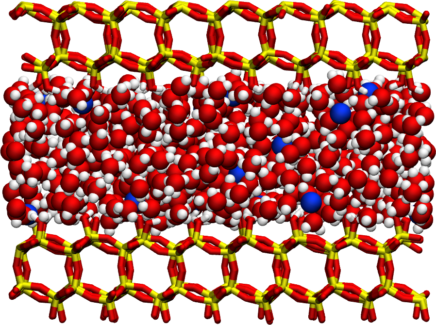

Water in Silica Dataset for NMRDfromMD
======================================

<a href="webp">
  
</a>

GROMACS input files and raw trajectory files used to generate the data
and figure from [nmrdfrommd](https://nmrdfrommd.github.io). The system
consists of water confined in a slit silica pore.

## Repository structure

- **[inputs](inputs)**: Contains the GROMACS input files. The [readlammps](https://github.com/simongravelle/read-lammps-data) pip package is required to create different systems.
- **[data](data)**: Contains simulation output files.
- **[analysis](analysis)**: Contains Python scripts for running NMRDfromMD
  and extract NMR relaxation rates.
- **[snapshot](snapshot)**: Contains ``.png`` images of the system generated
  using VMD.

## Clone the repository

To clone the repository, run:

```bash
git clone https://github.com/NMRDfromMD/dataset-water-in-silica.git
```

To regenerate the trajectory files, navigate to the [data](data) folder:
```bash
cd dataset-water-in-silica/data
```
Update the path to LAMMPS in ``run-all.sh`` to reflect your system
configuration:
```bash
lmp=/home/simon/Softwares/lammps-27Jun2024/src/lmp_mpi
```
Then, execute ``run-all.sh``.

## License

This repository is licensed under the Creative Commons Attribution 4.0
International (**CC BY 4.0**) [License](LICENSE).
